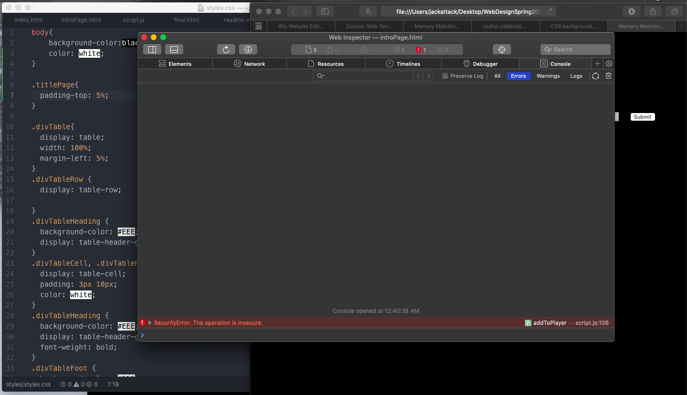

# HW-6

## Oh Boy
- This assignment was hands down one of the hardest assignments I've *ever* had. I think a lot of the struggle of mine came from an insanely busy week and not having the mental energy to put into fully trying to understand the code while watching the videos, but I really felt it when trying to figure out my homework.
- It is **Really** hard to take the tools you give us and apply it on our own. Without your walk through videos I feel as though it'd be like giving vocab words to students and asking them to make sentences. It's not exactly that but we have the pieces of the puzzle just no real idea on how to use them just yet. I feel like I have already learned so much in this class and I am beyond grateful. Even though I literally spend hours staring at code trying to understand it, I'm happy for it because I personally want to learn and strongly know how to code. I'm just beginning to feel anxious that I'll only really ever be able to read code but not necessarily understand it.
- My homework is about an hour late because I had it finished with a submit button at the bottom but I ultimately wanted to wait to see if I could figure out how to get the page to change automatically when the tiles all flipped. I couldn't figure it out unfortunately. When I looked as some classmates codes they had it by setting a limit of how many times someone could guess, and while I liked that idea, the page wouldn't turn unless they used up their guesses.
- I also couldn't get my code to work on safari. It kept saying the local storage pieces of code were insecure to continue???

``localStorage.setItem("playerInfo", JSON.stringify(player));``

